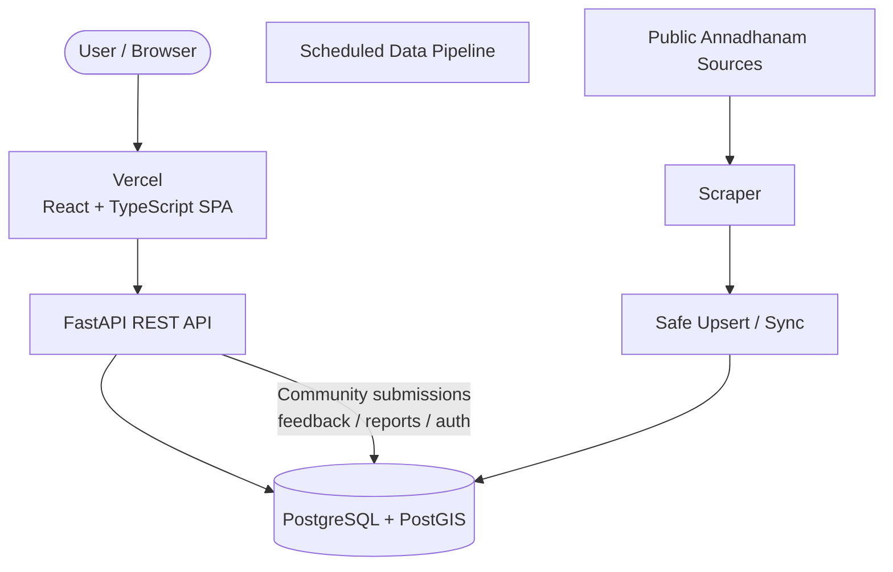
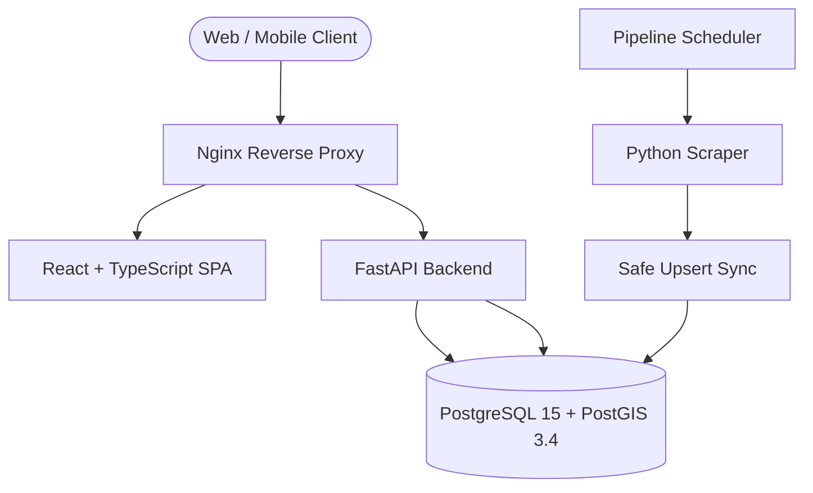
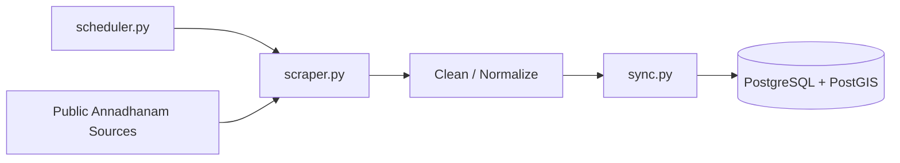

# Free Food Hyderabad

**Find free meals near you.**

Free Food Hyderabad is a community-powered platform for discovering **free meals, Annadhanam, temple meals, community meals, and free food distribution events across Hyderabad**.

> **Live Demo:** https://freefoodhyd.vercel.app  
> **Source Code:** https://github.com/Ravikiran9988/Free-food-hyd

The platform combines geospatial search, time-aware event availability, community feedback, automated data ingestion, and admin moderation into one full-stack application.

> **Data note:** The initial dataset is sourced from publicly accessible Annadhanam sources through the project's data pipeline. Information can change, so users should verify availability before travelling.

## ✨ Key Features

- 🗺️ **Location-based discovery** — Find free-food spots near you using geospatial queries and map-based exploration.
- 📍 **Interactive maps** — Browse locations with Leaflet and add new places using map pin selection.
- ⏱️ **Live availability states** — Organizes events into **Serving Now**, **Starting Soon**, **Later Today**, and upcoming events.
- 🔎 **Search & filtering** — Search by place, area, category, status, and location.
- 🤝 **Community contributions** — Users can submit new places, provide feedback, suggest corrections, and report inaccurate information.
- 🛡️ **Data provenance** — Distinguishes synced/source data from community-provided information.
- 🚦 **Community validation** — Recent confirmations and reports are surfaced to help communicate the current state of a food location.
- 🔐 **Authentication & authorization** — JWT-based authentication with user accounts and admin roles.
- 👨‍💼 **Admin dashboard** — Moderate submissions, reports, suggested updates, users, and community activity.
- 🔄 **Automated data synchronization** — Background scraper and scheduled sync update source data without overwriting protected community changes.
- 📱 **PWA / mobile-first UI** — Responsive experience designed for mobile and desktop.
- 🧪 **Automated testing** — Backend contract/community tests and Playwright-based end-to-end coverage.

## 🏗️ Current Architecture

The project is a modular monorepo with four main runtime components: **React frontend, FastAPI backend, PostgreSQL/PostGIS database, and the data pipeline**.

### Production / Hosted Flow



### Docker / Self-Hosted Flow



### Request Flow: "Find Near Me"

1. The frontend obtains the user's coordinates.
2. React calls the FastAPI REST API with latitude and longitude.
3. FastAPI passes the request to the database layer.
4. PostgreSQL + PostGIS performs geospatial distance calculations.
5. Matching food spots are returned as JSON.
6. React renders the results as cards and map markers.

The backend uses PostGIS spatial operations such as `ST_DistanceSphere` for distance-aware queries.

## 🔄 Data Pipeline

The data pipeline keeps the platform's source data synchronized while preserving community-maintained information.



**Pipeline responsibilities:**

- Extract data from the upstream source.
- Clean and normalize location/event information.
- Schedule recurring synchronization.
- Perform non-destructive upserts.
- Preserve manual/community changes where applicable.

## 🧰 Technology Stack

| Layer | Technologies |
|---|---|
| Frontend | React 19, TypeScript, Vite, TailwindCSS |
| Maps | Leaflet, React-Leaflet, MarkerCluster |
| Routing | React Router |
| Backend | Python, FastAPI |
| ORM / Spatial | SQLAlchemy, GeoAlchemy2 |
| Authentication | JWT |
| Database | PostgreSQL 15, PostGIS 3.4 |
| Data Pipeline | Python, Requests, Playwright |
| Infrastructure | Docker, Docker Compose, Nginx |
| Deployment | Vercel for the hosted frontend |
| Testing | Pytest, Playwright |
| CI / Automation | GitHub Actions |

## 📁 Repository Structure

```
Free-food-hyd/
├── apps/
│   ├── frontend/              # React + TypeScript application
│   │   ├── src/
│   │   │   ├── components/    # Reusable UI components
│   │   │   ├── context/       # Authentication/state context
│   │   │   ├── hooks/         # Data and application hooks
│   │   │   ├── pages/         # Application pages
│   │   │   ├── services/      # API client
│   │   │   └── types/         # TypeScript types
│   │   └── vercel.json        # SPA routing configuration
│   │
│   └── backend/
│       ├── app/               # FastAPI application
│       └── seed.py            # Admin bootstrap
│
├── data-pipeline/
│   ├── src/
│   │   ├── scraper.py         # Source extraction
│   │   ├── sync.py            # Database synchronization
│   │   └── scheduler.py       # Scheduled execution
│   └── data/                  # Raw and processed datasets
│
├── docs/                      # Architecture and engineering docs
├── infra/
│   ├── docker/                # Backend/frontend Dockerfiles
│   └── nginx/                 # Reverse proxy configuration
├── tests/
│   ├── backend/               # API and community tests
│   └── e2e/                   # End-to-end tests
│
├── .github/workflows/         # GitHub Actions automation
├── docker-compose.yml         # Local/self-hosted orchestration
└── README.md
```

## 🚀 Live Demo

### 🌐 Application

**https://freefoodhyd.vercel.app**

The hosted application is deployed as a Vercel-served React SPA. The frontend uses the `VITE_API_URL` environment variable to connect to the FastAPI backend.

### 💻 Repository

**https://github.com/Ravikiran9988/Free-food-hyd**

## 🐳 Run Locally with Docker

### 1. Clone

```bash
git clone https://github.com/Ravikiran9988/Free-food-hyd.git
cd Free-food-hyd
```

### 2. Configure environment

```bash
cp .env.example .env
```

Update the required values in `.env`, especially database, authentication, and upstream source credentials.

### 3. Start the stack

```bash
docker compose up -d --build
```

### 4. Open locally

- Frontend: http://localhost:8080
- Backend API: http://localhost:8000

## ⚙️ Configuration

Important environment variables include:

| Variable | Purpose |
|---|---|
| `DATABASE_URL` | Application PostgreSQL/PostGIS connection |
| `ADMIN_SECRET_KEY` | JWT signing and verification secret |
| `CORS_ORIGINS` | Allowed browser origins |
| `ADMIN_USERNAME` | Initial admin account |
| `ADMIN_PASSWORD` | Initial admin password |
| `SOURCE_SUPABASE_URL` | Read-only upstream source API |
| `SOURCE_SUPABASE_KEY` | Upstream source credential |
| `SYNC_SCHEDULE_HOUR` | Scheduled synchronization hour |
| `CRON_SECRET` | Secret for authenticated remote sync triggers |
| `VITE_API_URL` | Frontend FastAPI API base URL |

Never commit real passwords, JWT secrets, API keys, or production credentials.

## 🔐 Admin Setup

Admin access uses the same authentication system as normal users. Administrative permissions are determined by the user's database role.

### Docker

```bash
docker compose up -d --build
docker compose exec backend python seed.py
```

The seed command reads `ADMIN_USERNAME` and `ADMIN_PASSWORD` from the environment and creates or updates the admin account.

### Local Backend

Linux/macOS:

```bash
cd apps/backend
export PYTHONPATH="$(pwd)/app"
python seed.py
```

Windows PowerShell:

```powershell
cd apps/backend
$env:PYTHONPATH="$pwd/app"
python seed.py
```

## 📚 Documentation

- [Architecture](docs/architecture.md)
- [Setup](docs/setup.md)
- [Frontend](docs/frontend.md)
- [Backend](docs/backend.md)
- [API](docs/api.md)
- [Database](docs/database.md)
- [Data Pipeline](docs/data-pipeline.md)
- [Data Provenance](docs/data-provenance.md)
- [Community Features](docs/community-features.md)
- [Authentication & Security](docs/authentication-security.md)
- [Admin](docs/admin.md)
- [Testing](docs/testing.md)
- [Deployment](docs/deployment.md)
- [Environment](docs/environment.md)
- [Contributing](docs/contributing.md)
- [Troubleshooting](docs/troubleshooting.md)

## 🤝 Contributing

Contributions, bug reports, data corrections, and feature suggestions are welcome.

1. Fork the repository.
2. Create a feature branch.
3. Make your changes.
4. Run the relevant tests.
5. Open a pull request.

## 📄 License

MIT License
