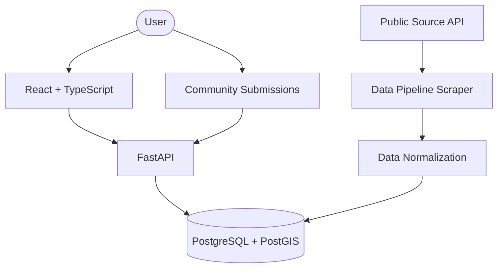

# Free Food Hyderabad

Find free meals near you.

Free Food Hyderabad is a community-powered platform for discovering free meals, Annadhanam, temple meals, community meals, and free food distribution events in Hyderabad. 

**Important:** The initial dataset comes from existing publicly accessible Annadhanam sources through the project's data pipeline. While the community can verify and update information, not all information is guaranteed to be community-verified or real-time. Please verify information before traveling.

## Key Features
- 🗺️ **Geographic Search & Map Interfaces**: Find free food locations near you using PostGIS spatial queries, and submit new places using an interactive map pin drop.
- 📅 **Time-Aware Availability**: View what's "Serving Now", "Starting Soon", or happening "Later Today".
- 🤝 **Community Contributions & Live Validation**: Add new spots, suggest updates, and report incorrect information. The platform uses plain-english heuristics (e.g. *"2 people recently said it's happening"*) to communicate consensus.
- 🚦 **Data Provenance Filters**: Easily filter out "Unverified Places" from canonical synced data, while maintaining proper categorization.
- 🛡️ **Graceful Data Sync & Admin Control**: Safe, non-destructive background synchronization from public sources, backed by a JWT-secured Admin Dashboard for moderating community submissions.
- 📱 **Mobile-First PWA Layout**: Fully responsive interface tailored for mobile screens.

## Architecture Overview
The platform uses a modern, modular architecture separated into distinct apps and pipelines.



## Technology Stack
- **Frontend**: React, TypeScript, Vite, TailwindCSS, React-Leaflet
- **Backend**: Python, FastAPI, SQLAlchemy, GeoAlchemy2, JWT
- **Database**: PostgreSQL 15, PostGIS 3.4
- **Data Pipeline**: Python, Requests, Playwright
- **Infrastructure**: Docker, Docker Compose, Nginx

## Repository Structure
```
free-food-hyderabad/
├── apps/
│   ├── frontend/         # React SPA
│   └── backend/app/      # FastAPI application
├── data-pipeline/        # Scraper and automated sync scripts
├── database/             # Database migrations
├── docs/                 # Detailed documentation
├── infra/                # Dockerfiles and Nginx configs
├── tests/                # E2E and unit tests
└── docker-compose.yml    # Local & deployment orchestration
```

## Quick Start (Docker)

1. Clone the repository
2. Copy `.env.example` to `.env` and set your secrets:
   ```bash
   cp .env.example .env
   ```
3. Spin up the entire stack:
   ```bash
   docker-compose up -d --build
   ```
4. Access the frontend at `http://localhost:8080` and the API at `http://localhost:8000`.

## Configuration

Copy `.env.example` to `.env` before running the stack. The template documents the database, JWT security, admin bootstrap, scheduler, and source configuration.

### Important environment variables

| Variable | Purpose |
|---|---|
| `DATABASE_URL` | PostgreSQL connection used by the backend |
| `ADMIN_SECRET_KEY` | JWT signing/verification secret; keep stable across backend instances |
| `CORS_ORIGINS` | Allowed browser origins; restrict in production |
| `ADMIN_USERNAME` | Admin bootstrap email/username used by `seed.py` |
| `ADMIN_PASSWORD` | Admin bootstrap password used by `seed.py` |
| `SYNC_SCHEDULE_HOUR` | Scheduled sync hour in UTC |
| `VITE_API_URL` | Optional frontend API URL, configured in the frontend Vite environment |

Never commit the real `.env`, passwords, JWTs, password hashes, or production secrets.

## Admin Setup

There is one authentication system for normal users and administrators. Admin access is determined by the database user's `admin` role; there is no separate admin login.

### Docker

After copying and configuring `.env`:

```bash
docker compose up -d --build
docker compose exec backend python seed.py
```

The seed command reads `ADMIN_USERNAME` and `ADMIN_PASSWORD` from the backend container environment. It creates the account if it does not exist, or promotes/updates the existing account to `admin`.

### Local development

With PostgreSQL/PostGIS running locally:

```bash
cd apps/backend
export PYTHONPATH="$(pwd)/app"
python seed.py
```

Windows PowerShell:

```powershell
cd apps/backend
$env:PYTHONPATH="$pwd/app"
python seed.py
```

Changing `ADMIN_PASSWORD` in `.env` does not automatically change an existing account; run the seed command again to apply it.

Keep `ADMIN_SECRET_KEY` unchanged across restarts. Changing it invalidates previously issued JWTs.

## Documentation Navigation

Detailed documentation can be found in the `docs/` directory:

- [Architecture](docs/architecture.md)
- [Setup](docs/setup.md)
- [Frontend](docs/frontend.md)
- [Backend](docs/backend.md)
- [API](docs/api.md)
- [Database](docs/database.md)
- [Data Pipeline](docs/data-pipeline.md)
- [Data Provenance](docs/data-provenance.md)
- [Community Features](docs/community-features.md)
- [Authentication & Security](docs/authentication-security.md)
- [Admin](docs/admin.md)
- [Testing](docs/testing.md)
- [Deployment](docs/deployment.md)
- [Environment](docs/environment.md)
- [Contributing](docs/contributing.md)
- [Troubleshooting](docs/troubleshooting.md)

## License
MIT License
