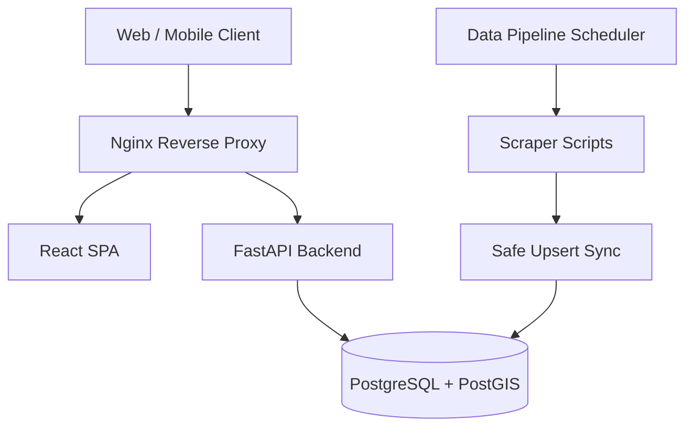

# Architecture

The Free Food Hyderabad platform is organized as a modular monorepo containing a React frontend, a Python FastAPI backend, a background data ingestion pipeline, and a PostGIS-enabled database.

## High-Level Architecture

## Frontend (React + TypeScript)
- **Location**: `apps/frontend/`
- **Role**: Serves the user interface, displaying maps, lists, and forms.
- **Key Modules**: React Router for navigation, Leaflet for maps, TailwindCSS for styling.
- **PWA**: Configured as a Progressive Web App via `manifest.json`.

## Backend (FastAPI)
- **Location**: `apps/backend/app/`
- **Role**: Provides RESTful APIs for the frontend, handles business logic, and manages community moderation.
- **Key Modules**:
  - `main.py`: Route definitions and dependency injection.
  - `crud.py`: Database operations and PostGIS queries.
  - `auth.py`: JWT-based authentication for admin routes.
  - `anti_abuse.py`: Rate limiting and cooldown mechanisms.

## Database (PostgreSQL + PostGIS)
- **Role**: Persistent storage for all entities.
- **Geospatial**: Utilizes `Geometry('POINT')` and `ST_DistanceSphere` to calculate distances accurately.

## Data Pipeline
- **Location**: `data-pipeline/`
- **Role**: Automates data extraction from public Annadhanam sources.
- **Flow**:
  1. `scheduler.py` runs nightly.
  2. `scraper.py` fetches and cleans raw data.
  3. `sync.py` performs a non-destructive upsert into PostgreSQL, preserving manual community edits.

## Request Flow Example: "Near Me" Query
1. Client requests `/spots/nearby?lat=17.3&lon=78.4`.
2. FastAPI receives the request and injects the database session.
3. `crud.get_nearby_spots` executes a PostGIS `ST_DistanceSphere` query against the `Spot` table.
4. Results are serialized via Pydantic schemas and returned as JSON.
5. React frontend renders the spots as cards and map pins.
